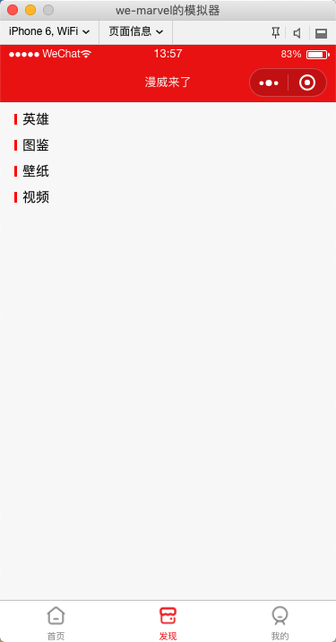
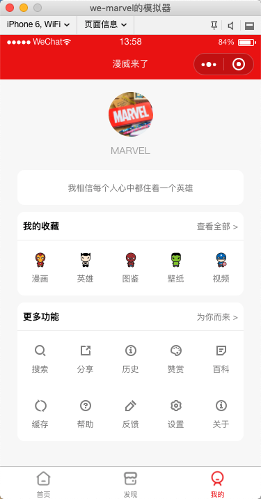

# we-marvel

微信小程序：漫威来了  
a mini program on wechat through the open api proided by Marvel.


## 概述

这是一个微信小程序项目：

* 首页：可以查看漫威官方所有漫画的信息。
* 英雄：查看漫威热门英雄信息及相关内容。
* 图鉴：查看漫威高清大图。
* 壁纸：查看漫威高清壁纸，可保存，适配手机尺寸。
* 视频：含漫威历史以来大多数电影预告片，正片精彩镜头等。
* 我的：提供收藏及部分类工具的功能。

> 注：目前只完成了漫威 Open API 部分的功能开发，相当于个雏形，待完善。


## 截图

| 主页 | 发现 | 我的
| -- | -- | --
|  |  | 

## 待办

* [ ] 优化首页漫画信息查看功能，及将部分内容改成中文。
* [ ] 使用小程序的云开发、腾讯视频插件完成发现页的开发。
  * [ ] 英雄
  * [ ] 图鉴
  * [ ] 壁纸
  * [ ] 视频
* [ ] 完成收藏、工具等功能的开发。
  * [ ] 我的收藏
  * [ ] 更多工具


## License

```
Copyright (C) 2018 zhuanghongji

Licensed under the Apache License, Version 2.0 (the "License");
you may not use this file except in compliance with the License.
You may obtain a copy of the License at

   http://www.apache.org/licenses/LICENSE-2.0

Unless required by applicable law or agreed to in writing, software
distributed under the License is distributed on an "AS IS" BASIS,
WITHOUT WARRANTIES OR CONDITIONS OF ANY KIND, either express or implied.
See the License for the specific language governing permissions and
limitations under the License.
```
