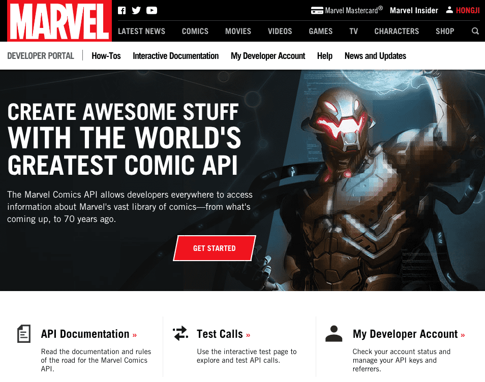
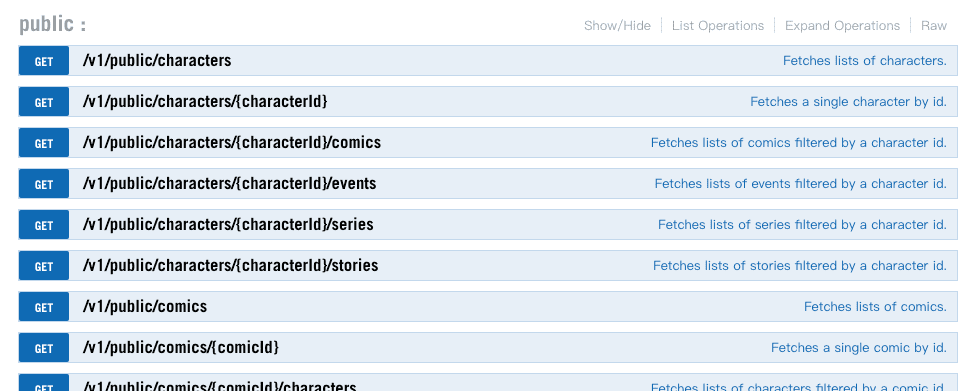
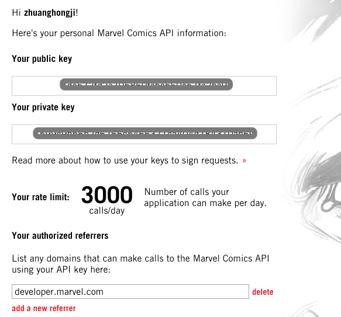

# 漫威官方：文档概述

链接：[https://developer.marvel.com/](https://developer.marvel.com/)

**漫威漫画 API 允许全世界的开发者访问其庞大漫画库的相关信息，不管是即将发行的漫画还是 70 年前的漫画。**

官方文档主要分为三个部分：

* How-Tos：一步异步展示如何利用开放 API 去开发应用。
* Interactive Documentation：显示了漫威 API 可用的所有端点，在这个页面你可以测试 API 的调用，分析返回结果等。
* My Developer Account：主要是你的开发账户具体信息。

## How-Tos

这部分内容还细分为七个部分：

1. [GETTING STARTED](https://developer.marvel.com/documentation/getting_started)
2. [GENERAL INFORMATION](https://developer.marvel.com/documentation/generalinfo)
3. [API RESULT](https://developer.marvel.com/documentation/apiresults)
4. [ENTITY TYPES](https://developer.marvel.com/documentation/entity_types)
5. [AUTHORIZING](https://developer.marvel.com/documentation/authorization)
6. [ATTRIBUTION, LINKING AND RATE LIMITS](https://developer.marvel.com/documentation/attribution)
7. [IMAGES](https://developer.marvel.com/documentation/images)

## Interactive Documentation

链接：[https://developer.marvel.com/docs](https://developer.marvel.com/docs)

## My Developer Account

链接：[https://developer.marvel.com/account](https://developer.marvel.com/account)

Now, please enjoy it!

@
