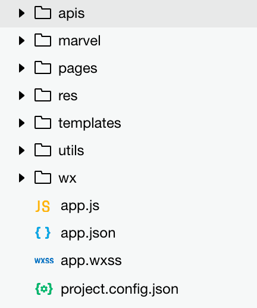

# 漫威来了：文档概述

代码结构：

* apis: 封装了漫威每个具体 API 的调用。
* marvel: 在微信请求上做一层封装，解决请求时加签的问题。
* pages: 放置具体页面代码。
* res: 放置图片资源。
* templates: 放置视图模板。
* utils: 放置工具方法。
* wx: 封装了微信的 API，同时解决请求结果的缓存问题。

> 当前的代码及代码结构都相对简单，后续会在项目的完善过程作相关变化。
